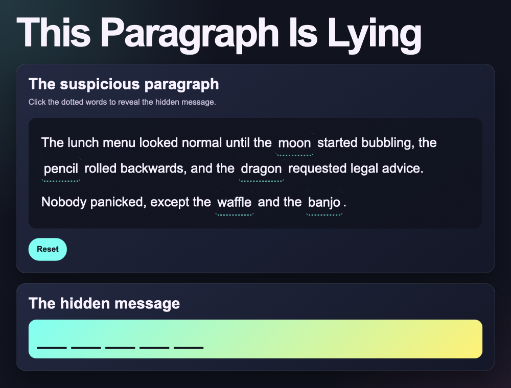

## Change the clue words

Each clue button has a visible word that people **see**: in the example they are: **soup, fruit, pasta, toast** and **printer**. You can find the words in between the tags. 

In `index.html` change all five visible words to your own ones:

--- code ---
---
language: html
filename: index.html
line_numbers: true
line_number_start: 21
line_highlights: 23,25,27,33,35
---

  The lunch menu looked normal until the
  <button class="clue-word" hidden-word="your" aria-pressed="false" type="button">soup</button>
  started bubbling, the
  <button class="clue-word" hidden-word="homework" aria-pressed="false" type="button">fruit</button>
  rolled backwards, and the
  <button class="clue-word" hidden-word="escaped" aria-pressed="false" type="button">pasta</button>
  requested legal advice.

  Nobody panicked, except the
  <button class="clue-word" hidden-word="into" aria-pressed="false" type="button">toast</button>
  and the
  <button class="clue-word" hidden-word="space" aria-pressed="false" type="button">printer</button>.

--- /code ---

### Now run your code

Run the project. Your new words should appear in the paragraph.

