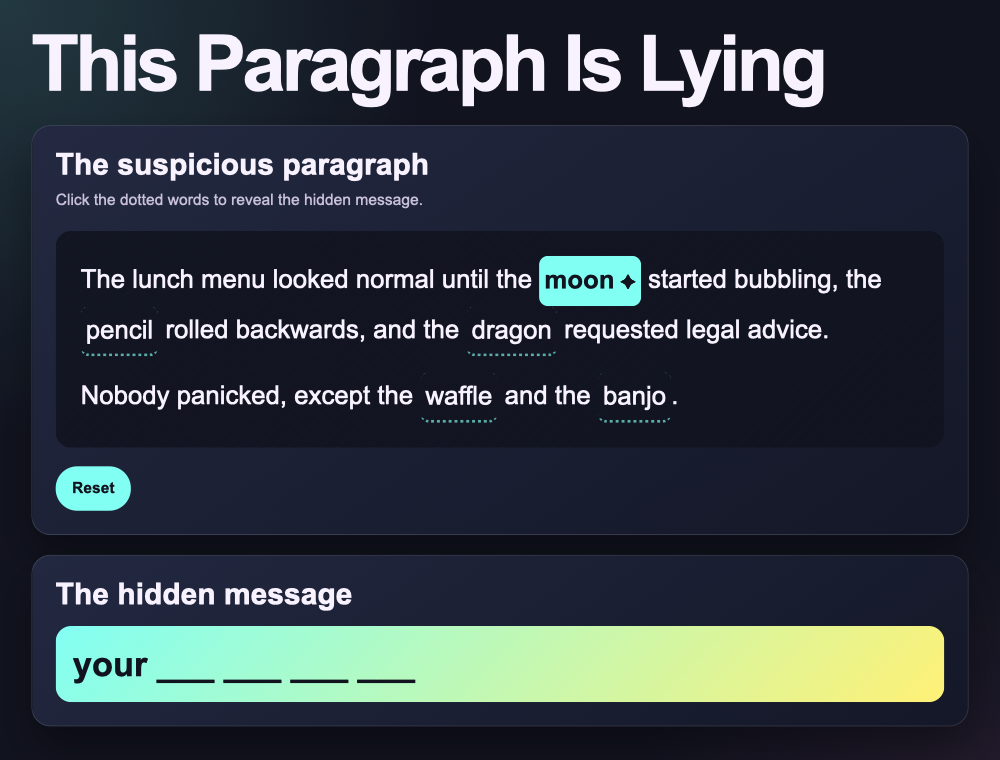

## Make the clues clickable

Right now clicking a clue word does nothing. Add this loop to `script.js`, below the comment that says `// Add your code below.`

> ### Tip
>
> This loop gives every clue button a click listener. When you click a clue, it switches between found and not found, and updates the message.
{: .c-project-callout .c-project-callout--tip}

--- code ---
---
language: javascript
filename: script.js
line_numbers: true
line_number_start: 25
line_highlights: 27-34
---
// Add your code below.

for (const clue of clueWords) {
  clue.addEventListener("click", () => {
    const isFound = clue.classList.contains("is-found");

    setClueFound(clue, !isFound);
    showMessage();
  });
}
--- /code ---

### Now run your code

Click a dotted word. It should glow and reveal one word in the hidden message box. Click it again and it should go back to a blank.

> ### Debugging
>
> If clicking does nothing, check that your loop is not accidentally inside the curly brackets `{}` of another function. It should sit on its own below `// Add your code below.`
{: .c-project-callout .c-project-callout--debug}

