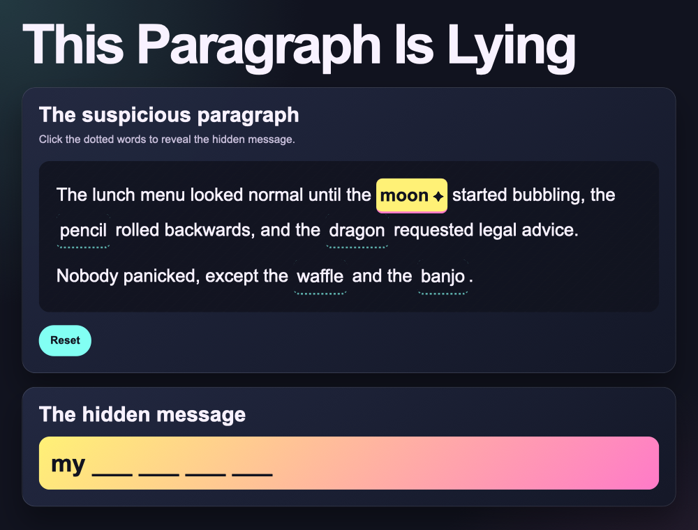

## Style it!

### Step 1 
In the project file tab, open `style.css`.

> ### Tip
>
> Change `background` to a colour you like. Add `border-bottom-color` to choose the line colour. Colours use hex codes — `#ff0000` is red, `#0000ff` is blue, `#ffffff` is white.
{: .c-project-callout .c-project-callout--tip}

### Step 2
Change how the clue words look by editing `.clue-word.is-found`.

--- code ---
---
language: css
filename: style.css
line_numbers: true
line_number_start: 122
line_highlights: 123,125
---
.clue-word.is-found {
  background: #fff176;
  color: #11131f;
  border-bottom-color: #ff7ac8;
  border-bottom-style: solid;
  font-weight: 900;
}
--- /code ---

### Step 3

You can also change the colours of the hidden message box. Find `.hidden-message` in `style.css` and change the two colours in the `background` line.

> ### Tip
>
> Replace `var(--clue)` and `var(--warning)` with hex codes of your own to give the message box a new look.
{: .c-project-callout .c-project-callout--tip}

--- code ---
---
language: css
filename: style.css
line_numbers: true
line_number_start: 157
line_highlights: 162
---
.hidden-message {
  min-height: 4rem;
  margin: 1rem 0 0;
  padding: 1.1rem;
  border-radius: 1rem;
  color: var(--dark-text);
  background: linear-gradient(135deg, var(--clue), var(--warning));
  font-size: clamp(1.3rem, 4vw, 2.2rem);
  font-weight: 900;
  line-height: 1.25;
}
--- /code ---

### Now run your code

Click a clue word. It should glow in your new colours.

> ### Tip
>
> Search "hex colour picker" in a browser to find the hex code for any colour you want.
{: .c-project-callout .c-project-callout--tip}

