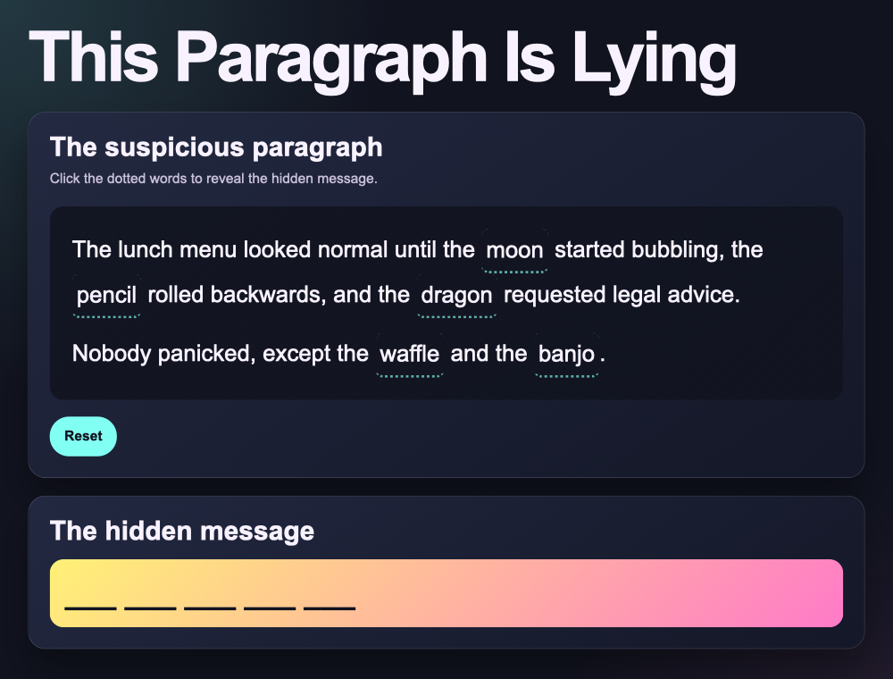

## Reset the clues

In `script.js` add this code to clear the clues.

--- code ---
---
language: javascript
filename: script.js
line_numbers: true
line_number_start: 36
line_highlights: 36-42
---
resetButton.addEventListener("click", () => {
  for (const clue of clueWords) {
    setClueFound(clue, false);
  }

  showMessage();
});
--- /code ---

### Now run your code

Click a few clue words, then click Reset. Every clue should stop glowing and the hidden message should show blanks again.

