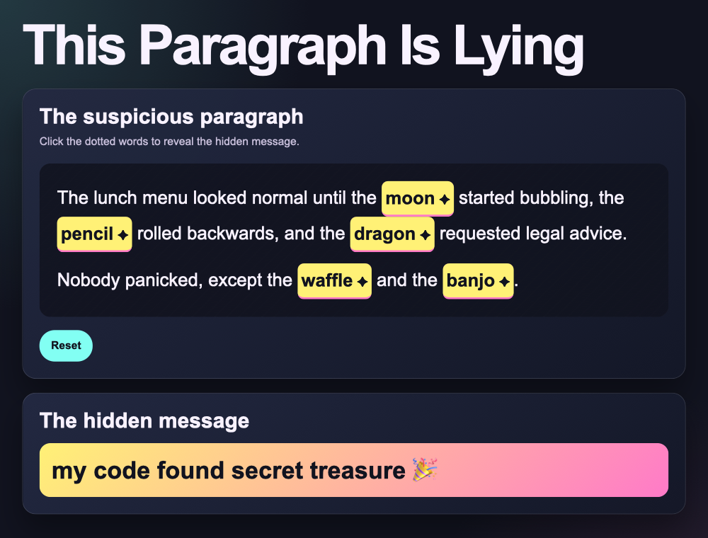

## Challenge: add a complete message

At the moment nothing happens when you find all five clues. Add something that appears when the puzzle is complete.

In `script.js` add the code below and change `" 🎉"` to your own emoji, a celebration word, or short phrase.

--- code ---
---
language: javascript
filename: script.js
line_numbers: true
line_number_start: 22
line_highlights: 24-26
---
  hiddenMessage.textContent = words.join(" ");

  if (!words.includes("___")) {
    hiddenMessage.textContent = words.join(" ") + " 🎉";
  }
}
--- /code ---

### Now run your code

Find all five clues. When you click the last one, your complete message should appear at the end.

